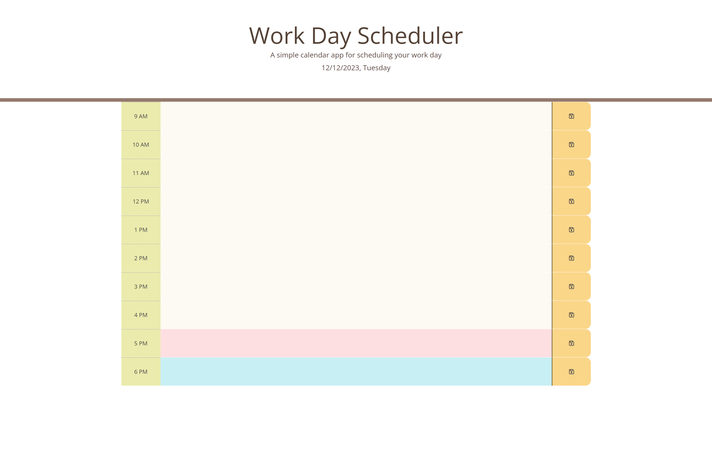
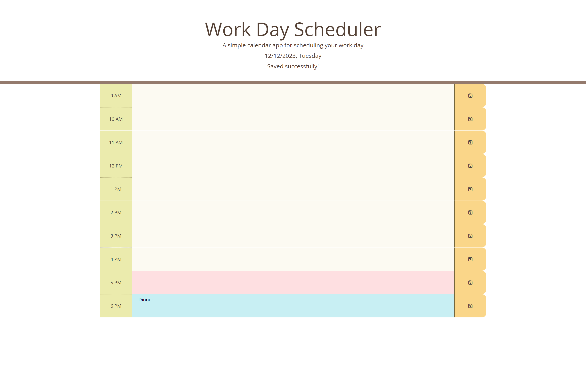

# W7-Worktime-Scheduler

## Description
This scheduler allows users to save events for each working hour of the current day through a user-friendly interface. The app runs in the browser, featuring updated HTML and CSS powered by jQuery.

## Folder Structure

- **index.html**: The Main HTML file for this scheduler.
- **assets:** includes 2 subfolders for styles (css) and  JavaScript.
  - **css:** css file for styling.
  - **js:** JavaScript file for the application
- **screencapture:** includes 2 screenshot images.
  - **screencapture-W7-Worktime-Scheduler-1.jpg:** Screenshot for the html.
  - **screencapture-W7-Worktime-Scheduler-2.jpg:** Screenshot after saving.
- **README.md:** This file.

## Links

[Visit my application](https://celia103.github.io/W7-Worktime-Scheduler/)

[Visit the GitHub repository](https://github.com/celia103/W7-Worktime-Scheduler)

- Application Screenshot:

- Screenshot for using the scheduler:

## License

MIT License
